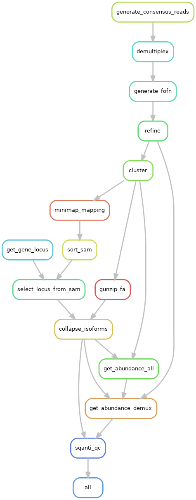

# APTARS - Analysis of Pacbio TARgeted Sequencing

<!-- badges: start -->


[](https://github.com/sid-sethi/APTARS/blob/main/LICENSE)
<!-- badges: end -->

APTARS is a `snakemake` pipeline that takes PacBio subreads as input, generates consensus reads using CCS, demultiplexes using lima, refines and cluster using isoseq3, map the reads to the genome using minimap2, assembles gene transcripts using cDNA_cupcake and annotates transcripts using Sqant3. Note that **APTARS** can also be used for **un-targetted** Pacbio data. Below is the dag of the pipeline:  

<p align="center">
    
</p>


# Getting Started

## Input

- PacBio subreads.bam
- Primers in fasta format

	Example format:

	```bash
	>Clontech_5p
	AAGCAGTGGTATCAACGCAGAGTACATGGGG
	>C1_3_UT_3p
	CGCACTCTGATATGTGGTACTCTGCGTTGATACCACTGCTT
	>C1_1_UT_3p
	CTCACAGTCTGTGTGTGTACTCTGCGTTGATACCACTGCTT
	>C3_1_UT_3p
	CTCTCACGAGATGTGTGTACTCTGCGTTGATACCACTGCTT
	>C4_1_UT_3p
	CGCGCGTGTGTGCGTGGTACTCTGCGTTGATACCACTGCTT
	```
	
	The primer ids **must** contain the information on whether they are 5 prime or 3 prime as "_5p" or "_3p" suffix respectively.

- Reference genome assembly in fasta format
- GTF: [Gencode GTF](https://www.gencodegenes.org/human/); tested on v38 comprehensive CHR gene annotation
- Cage peaks: [refTSS](http://reftss.clst.riken.jp/reftss/Main_Page); tested on `refTSS_v3.3_human_coordinate.hg38.bed`
- [Intropolis](https://github.com/nellore/intropolis): tested on [intropolis.v1.hg19_with_liftover_to_hg38.min_count_10.tsv](https://github.com/Magdoll/images_public/tree/master/SQANTI2_support_data)
- [Poly(a) atlas](https://polyasite.unibas.ch/): tested on [atlas.clusters.2.0.GRCh38.96.bed](https://polyasite.unibas.ch/atlas#2)
- Poly(A) list: [Human Poly(A) list](https://github.com/Magdoll/images_public/tree/master/SQANTI2_support_data) included in the pipeline (`/data`) and is automatically used

**Make sure the contig names in the annotation files and reference genome are the same.**

## Depedencies

- [miniconda](https://conda.io/miniconda.html)
- [SQANTI3](https://github.com/ConesaLab/SQANTI3): v4.2 - https://github.com/ConesaLab/SQANTI3/archive/refs/tags/v4.2.tar.gz
- The rest of the dependencies (including snakemake) are installed via conda through the `environment.yml` file

**SQANTI3 setup:**  
```bash
wget https://github.com/ConesaLab/SQANTI3/archive/refs/tags/v4.2.tar.gz
tar -xvf v4.2.tar.gz
echo "  - cdna_cupcake=22.0.0" >> SQANTI3-4.2/SQANTI3.conda_env.yml
```


## Installation

Clone the directory:

```bash
git clone --recursive https://github.com/sid-sethi/APTARS.git
```

Create conda environment for the pipeline which will install all the dependencies:

```bash
cd APTARS
conda env create -f environment.yml
```

## Usage

Edit `config.yml` to set up the working directory and input files/directories. `snakemake` command should be issued from within the pipeline directory. Please note that before you run any of the `snakemake` commands, make sure to first activate the conda environment using the command `conda activate aptars`.

```bash
cd APTARS
conda activate aptars
snakemake --use-conda -j <num_cores> all
```
It is a good idea to do a dry run (using -n parameter) to view what would be done by the pipeline before executing the pipeline.

```bash
snakemake --use-conda -n all
```

You can visualise the processes to be executed in a DAG:

```bash
snakemake --dag | dot -Tpng > dag.png
```

To exit a running `snakemake` pipeline, hit `ctrl+c` on the terminal. If the pipeline is running in the background, you can send a `TERM` signal which will stop the scheduling of new jobs and wait for all running jobs to be finished.

```bash
killall -TERM snakemake
```

To deactivate the conda environment:
```bash
conda deactivate
```

## Output
```
working directory  
|--- config.yml           # a copy of the parameters used in the pipeline  
|--- Consensus_reads/  
     |-- # output of CCS  
|--- Demultiplxed/  
     |-- # output of lima  
|--- Refine/  
     |-- # output of isoseq3 refine  
|--- Cluster/  
     |-- # output of isoseq3 cluster  
|--- Mapping/  
     |-- # output of minimap2  
|--- Collapsed_isoforms/  
     |-- # output of cDNA_cupcake  
|--- Sqanti/  
     |-- # output of sqanti3  
```
